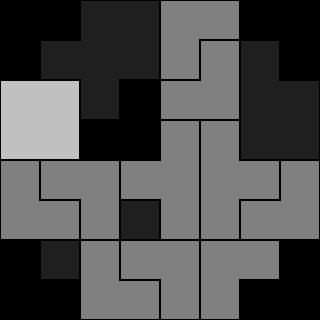

# solveKlotski
A program to visually solve any Klotski or ‘Sliding Block’ puzzle. 

solveKlotski will visually solve any [Klotski or ‘Sliding Block’ puzzle](http://en.wikipedia.org/wiki/Klotski) you throw at it. You’ll get a step-by-step solution in the form of PGM image files. Just add your own Klotski puzzle to puzzles.h and you’re good to go.

If you have no idea what a ‘Klotski’ is, maybe this animated GIF will give you an idea (click to see it in action):

You may freely use solveKlotski and it’s source codes under any terms you wish. The inspiration and motivation for this came from one of the excellent [Professor Layton Games for the Nintendo DS](http://professorlayton.nintendo.com/).
